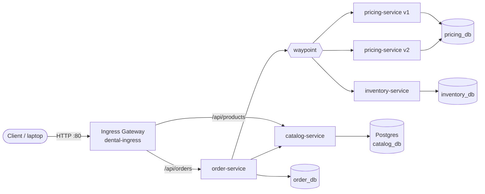
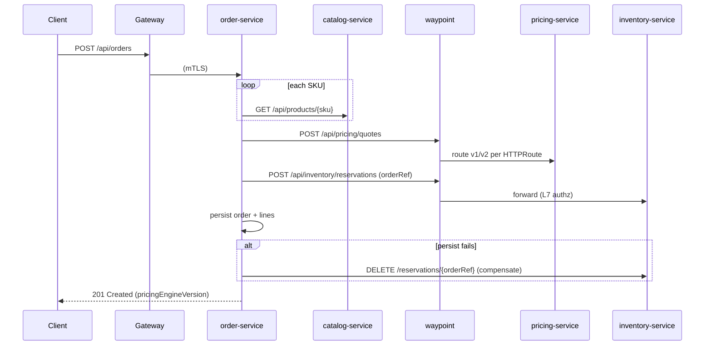

# Architecture — Dental OMS on Istio Ambient

## 1. Context and goals

The Dental Order Management System (OMS) is a deliberately small, realistic microservice system. It exists to exercise Istio service-mesh capabilities against Spring Boot services. Business logic is kept simple so that mesh behaviour is the focus.

**Goals**

1. Show which non-functional concerns can be delegated from application code to the platform.
2. Establish coding conventions for Spring Boot services that run behind a mesh.
3. Provide a repeatable local environment for evaluating Istio ambient mode.

**Non-goals:** production hardening, multi-cluster topologies, CI/CD.

## 2. Logical view

All four databases are hosted on one Postgres instance in namespace `dental-data`. Each service has its own database and login role.

## 3. Services

| Service | Responsibility | Inbound callers | Outbound calls | Data |
|---|---|---|---|---|
| order-service | Order placement and orchestration | Gateway | catalog, pricing, inventory | `order_db` |
| catalog-service | Product master data | Gateway, order-service | — | `catalog_db` |
| pricing-service (v1, v2) | Quotes; v2 adds volume discounts | order-service | — | `pricing_db` |
| inventory-service | Stock and reservations | order-service | — | `inventory_db` |

## 4. Order placement sequence

## 5. Deployment view (Kubernetes)

| Namespace | Mesh mode | Workloads |
|---|---|---|
| `istio-system` | control plane | istiod, istio-cni, ztunnel (DaemonSet), add-ons |
| `dental-ingress` | gateway | `dental-gateway-istio` (Envoy, Gateway API) |
| `dental` | ambient | four services (pricing has 2 Deployments), waypoint, curl-client |
| `dental-data` | ambient | Postgres StatefulSet |
| `dental-sidecar` | sidecar (lab 09) | catalog-service copy |

Each workload runs under a dedicated ServiceAccount, which yields its mTLS identity `spiffe://cluster.local/ns/<ns>/sa/<sa>`.

## 6. Responsibility split: application vs mesh

| Concern | Application | Mesh |
|---|---|---|
| Service discovery / load balancing | Uses Service DNS names only | Kubernetes Services, waypoint LB |
| Transport security | — | mTLS via ztunnel (HBONE) |
| Service-to-service authorization | — | `AuthorizationPolicy` (L4 ztunnel, L7 waypoint) |
| Retries / timeouts / circuit breaking | Coarse safety-net timeouts; **idempotent writes** | `HTTPRoute` timeouts, default retries, `DestinationRule` outlier detection |
| Canary / routing | **Propagates routing headers** | `HTTPRoute` weights and header matches |
| Metrics | Business and JVM metrics (Micrometer) | Golden signals (gateway, waypoint, ztunnel) |
| Tracing | **Propagates trace headers** (W3C + B3) | Emits spans at gateway and waypoints |

The application column is intentionally thin. Its obligations are propagation and idempotency.

## 7. Data management

- Database-per-service on a shared Postgres server. Isolation is enforced by role ownership and `REVOKE ... FROM PUBLIC`, and additionally by identity-based L4 policy on port 5432 (lab 04).
- Each service owns its schema through Flyway (`V1` schema, `V2` seed).
- No cross-service joins. Order lines store a snapshot of product name and price at order time.

## 8. Known limitations

- Single Postgres instance and single replica per service. This is not representative of production availability.
- No authentication of end users. Authorization covers service identity only.
- Order and reservation consistency uses synchronous calls with compensation, not a saga or outbox.
- Plaintext development credentials in manifests.
